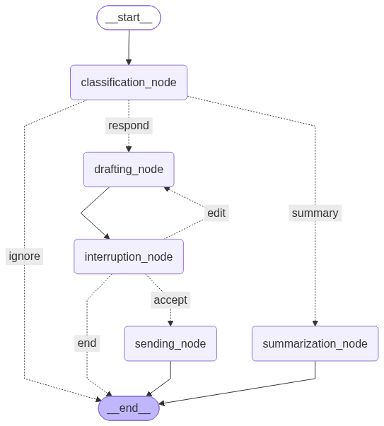
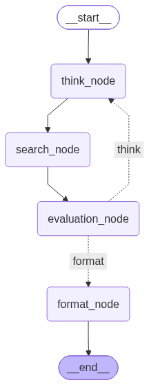
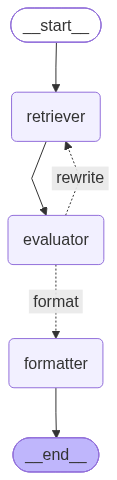

# AI Agents with LangGraph

A collection of production-ready AI agents built with **LangGraph**, **LangChain**, and **Claude/Groq LLMs**. Each agent demonstrates core agentic patterns: state management, tool calling, conditional routing, and human-in-the-loop workflows.

🎯 **Goal:** Build increasingly complex agents to master LangGraph concepts and agentic design patterns.

---

## Agents Overview

### 1️⃣ Agent 1: Email Triage with Human-in-the-Loop

**What it does:** Classifies incoming emails and drafts replies with human approval workflow.

**Flow:**
- Classifies emails into: `urgent`, `needs_reply`, `spam`, `fyi`
- Routes based on classification
- Drafts professional replies for urgent/needs_reply
- Human reviews and can approve, edit, or reject
- Loop back on edits until satisfied

**Key Concepts:**
- ✅ Structured output (Pydantic models)
- ✅ Conditional edge routing
- ✅ Human-in-the-loop with interrupt
- ✅ State management across loops

**Tech Stack:**
- LLM: Groq (openai/gpt-oss-120b)
- Graph visualization: StateGraph with conditional edges
- Classification confidence scoring

**Graph Visualization:**


**Result Example:**
```
Classification: urgent (confidence: 0.92)
Justification: The user said "ASAP" and needs approval
Draft: [Professional email reply]
Human: [Approve/Edit/Reject]
```

📂 **Folder:** `agent-1-inbox-triage/`

---

### 2️⃣ Agent 2: Research Agent with Web Search

**What it does:** Answers questions by searching the web and returning sourced answers.

**Flow:**
- Takes a user question
- Thinks about what to search for
- Calls Tavily web search API
- Evaluates if results answer the question
- If not, rewrites query and searches again (ReAct loop)
- Returns formatted answer with citations

**Key Concepts:**
- ✅ ReAct loop (Think → Act → Observe)
- ✅ Tool calling (web search API)
- ✅ Loop with iteration limits
- ✅ Answer grading by LLM

**Tech Stack:**
- LLM: Groq
- Search: Tavily API (free tier)
- Loop limit: 3 iterations max

**Graph Visualization:**


**Result Example:**
```
Question: "Latest Python trends 2026?"
Search 1: "Python programming trends 2026"
Evaluate: Score 0.8 (good)
Answer: [Formatted response with 3 sources/citations]
```

📂 **Folder:** `agent-2-research/`

---

### 3️⃣ Agent 3: RAG with Self-Correcting Retrieval

**What it does:** Answers questions from your documents with self-correcting retrieval.

**Flow:**
- Loads and chunks your documents (PDF/text)
- Creates semantic embeddings with HuggingFace
- Retrieves relevant chunks using FAISS vector store
- Grades retrieval quality with LLM
- If retrieval is poor, rewrites query and retrieves again
- Formats final answer from best chunks

**Key Concepts:**
- ✅ Document chunking with overlap
- ✅ Semantic search (embeddings + FAISS)
- ✅ Retrieval grading/evaluation
- ✅ Query rewriting on poor retrieval

**Tech Stack:**
- LLM: Groq
- Embeddings: HuggingFace Transformers
- Vector store: FAISS (in-memory)
- Document loading: pdfplumber, pypdf

**Graph Visualization:**


**Result Example:**
```
Question: "What are your skills?"
Retrieved: [3 relevant resume chunks]
Grade: 0.85 (relevant)
Answer: [Formatted answer with skill categories]
```

📂 **Folder:** `agent-3-rag/`

---

## Project Structure

```
AI_AGENTS_101/
├── agent-1-inbox-triage/
│   ├── .env
│   ├── .venv/
│   ├── graph.py
│   ├── requirements.txt
│   └── graph_visualization.png
│
├── agent-2-research/
│   ├── .env
│   ├── .venv/
│   ├── research_agent.py
│   ├── requirements.txt
│   └── graph_visualization.png
│
├── agent-3-rag/
│   ├── .env
│   ├── .venv/
│   ├── rag_agent.py
│   ├── requirements.txt
│   ├── resume_en.pdf
│   └── graph_visualization.png
│
└── README.md (this file)
```

---

## Setup & Run

### Prerequisites
- Python 3.11+
- API Keys: Groq, LangSmith (optional), Tavily (for Agent 2)

### Quick Start

**Agent 1: Email Triage**
```bash
cd agent-1-inbox-triage
python -m venv .venv
.venv\Scripts\Activate.ps1
pip install -r requirements.txt
python graph.py
```

**Agent 2: Research**
```bash
cd agent-2-research
python -m venv .venv
.venv\Scripts\Activate.ps1
pip install -r requirements.txt
python research_agent.py
```

**Agent 3: RAG**
```bash
cd agent-3-rag
python -m venv .venv
.venv\Scripts\Activate.ps1
pip install -r requirements.txt
python rag_agent.py
```

---

## Tech Stack

- **Framework:** LangGraph (agent orchestration)
- **LLM:** Groq (free, fast)
- **LangChain:** Integrations, embeddings, tools
- **Tools:** Tavily (search), FAISS (vectors), HuggingFace (embeddings)
- **Tracing:** LangSmith (optional, for debugging)

---

## Author

Built by learning LangGraph from scratch—no copy-paste. Each agent teaches one core concept.

**LinkedIn:** Coming soon with demos 🚀

---

## License

MIT

